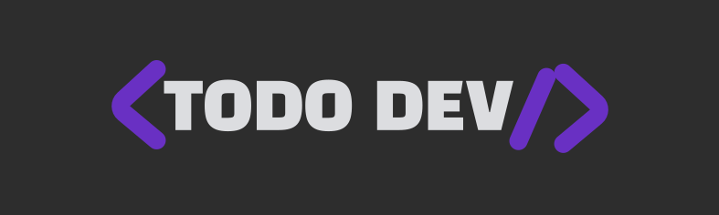
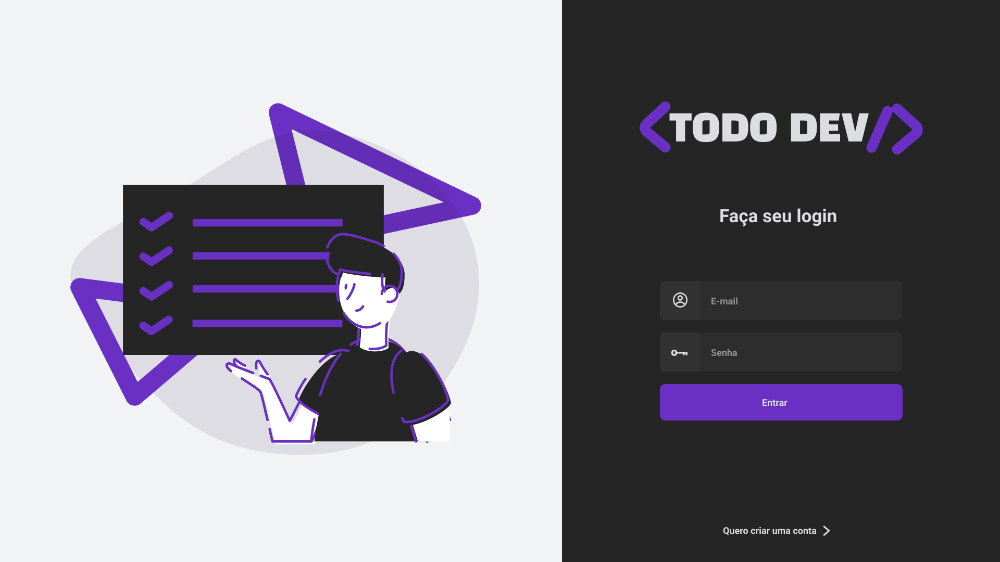
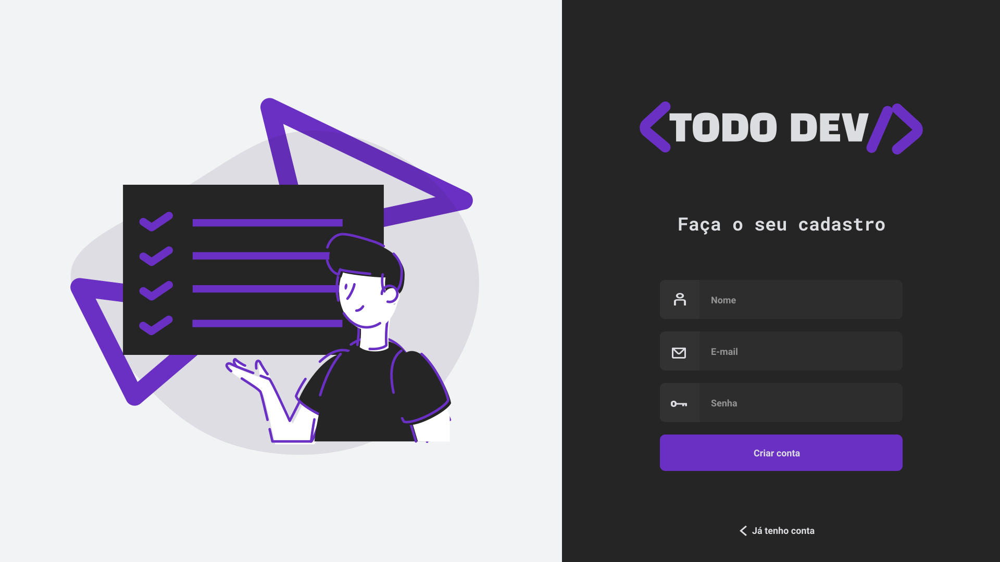
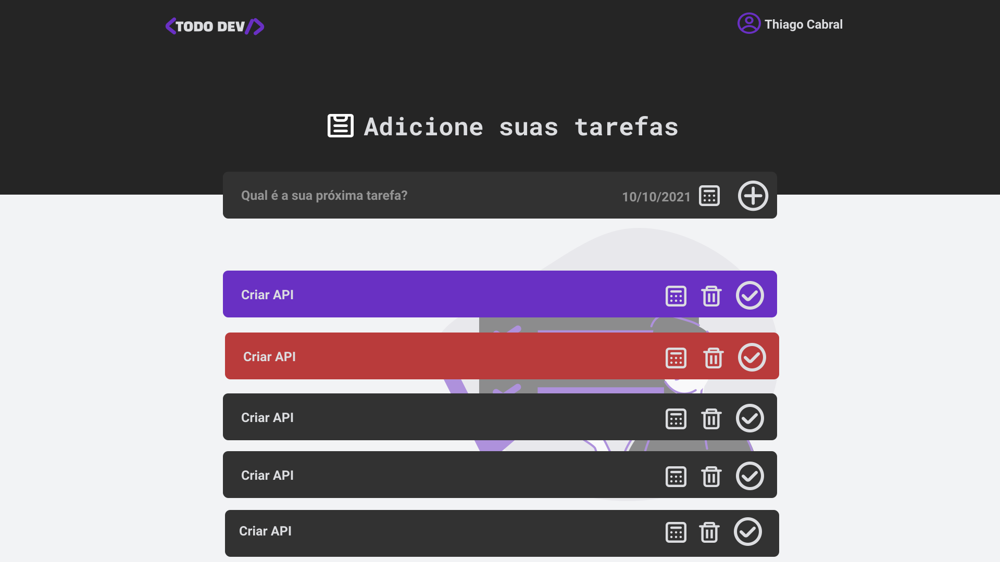
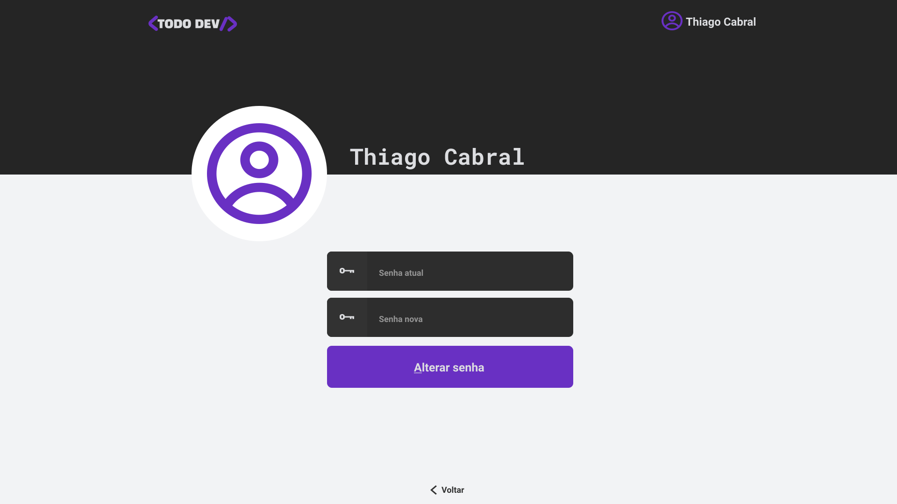

<h1 align="center">
  
</h1>

<p align="center">
 <a href="#-sobre-o-projeto">Sobre</a> •
 <a href="#-funcionalidades">Funcionalidades</a> •
 <a href="#-layout">Layout</a> •
 <a href="#-como-executar-o-projeto">Como executar</a> •
 <a href="#-tecnologias">Tecnologias</a> •
 <a href="#-autor">Autor</a> •
 <a href="#user-content--licença">Licença</a>
</p>
<br>

## 💻 Sobre o projeto

**[To-Do](http://priscilastuani.com.br/vantagens-em-usar-um-to-do-list/#:~:text=To%2DDo%20Lists%20s%C3%A3o%20listas,na%20parte%20inferior%20da%20lista.)** Lists são listas de todas as tarefas que você precisa realizar, ou seja, elas listam tudo que você tem a fazer, com as tarefas mais importantes no topo, e as tarefas menos importantes na parte inferior da lista.

Esse projeto foi desenvolvido com as tecnologias que venho estudado ultimamente, para fixar o que venho aprendendo.

---

## ⚙️ Funcionalidades

**Back-end:**

- [x] O usuário pode criar uma conta com **_name_**, **_email_** e **_password_**.
- [x] A senha vai criptografada para o banco de dados
- [x] Autenticação nas rotas com JWT
- [x] Rota de criação de tasks
- [x] Rota de listagem de tasks
- [x] Rota de alteração de status da task
- [x] Rota de remoção de task
- [x] Rota de alteração de senha

**Front-end**

- [x] Autenticação nas rotas
- [x] SignIn
- [x] SignUp
- [x] Criação de tasks
- [x] Listagem de tasks
- [x] Remoção de task
- [x] Atualizar status da task
- [x] Prioridade de task por data
- [x] Alterar senha

---

## 🎨 Layout

O layout da aplicação está disponível no Figma:

<a href="https://www.figma.com/file/D5o4hftFQztddxSKCBdXrO/Todo-Dev?node-id=0%3A1">
  
</a>

<p align="center">
  

  

  

  
</p>

---

## 🚀 Como executar o projeto

### Pré-requisitos

- [x] [Git](https://git-scm.com)
- [x] [Node.js](https://nodejs.org/en/)
- [x] [PostgreSQL](https://www.postgresql.org/)

### 🧭 Rodando a aplicação

```bash
# Clone este repositório
$ git clone https://github.com/thsthiago/todo_dev.git

# Acesse a pasta do projeto no seu terminal/cmd
$ cd todo_dev
```

### Back-end

```bash
# Crie um banco de dados utilizando o PostgreSQL com o
# nome "todo-node-express"

# Acesse a pasta back-end
$ cd back-end

# Instale as dependências
$ yarn

# Crie as tabelas no banco de dados
$ yarn typeorm migration:run

# Execute a aplicação
$ yarn dev:server

# A api será aberta na porta:3333
$ http://localhost:3333
```

### Front-end

```bash
# Acesse a pasta front-end
$ cd front-end

# Instale as dependências
$ yarn

# Execute a aplicação
$ yarn start

# A aplicação será aberta na porta:3000
$ http://localhost:3000
```

---

## 🛠 Tecnologias

As seguintes ferramentas foram usadas na construção do projeto:

**_Back-end_:**

- **Node JS**
- **Typescritp**
- **Express.js**
- **Jsonwebtoken**
- **Uuidv4**
- **Typeorm**
- **Pg**
- **Eslint**
- **ts-node-dev**

**_Front-end_:**

- **React JS**
- **React-router-dom**
- **React-spring**
- **React-icons**
- **Styled-components**
- **@unform**
- **date-fns**
- **Typescript**
- **uuid**
- **Yup**
- **Eslint**
- **axios**

#### [](https://github.com/tgmarinho/Ecoleta#utilit%C3%A1rios)**Utilitários**

- Editor: **[Visual Studio Code](https://code.visualstudio.com/)**
- Consultas na api: **[insominia](https://insomnia.rest/download)**
- DBeaver: **[DBeaver](https://dbeaver.io/download/)**
- PostgreSQL: **[PostgreSQL](https://www.postgresql.org/)**

---

## 👨🏽‍💻 Autor

 
 <br />
 <sub><b>Thiago Cabral</b></sub></a>
 <br />

[](https://www.linkedin.com/in/thsthiago-cabral/)
[](mailto:thiagocabral477@gmail.com)

---

## 📝 Licença

Este projeto esta sobe a licença [MIT](./LICENSE).

Feito por Thiago Cabral 🚀
